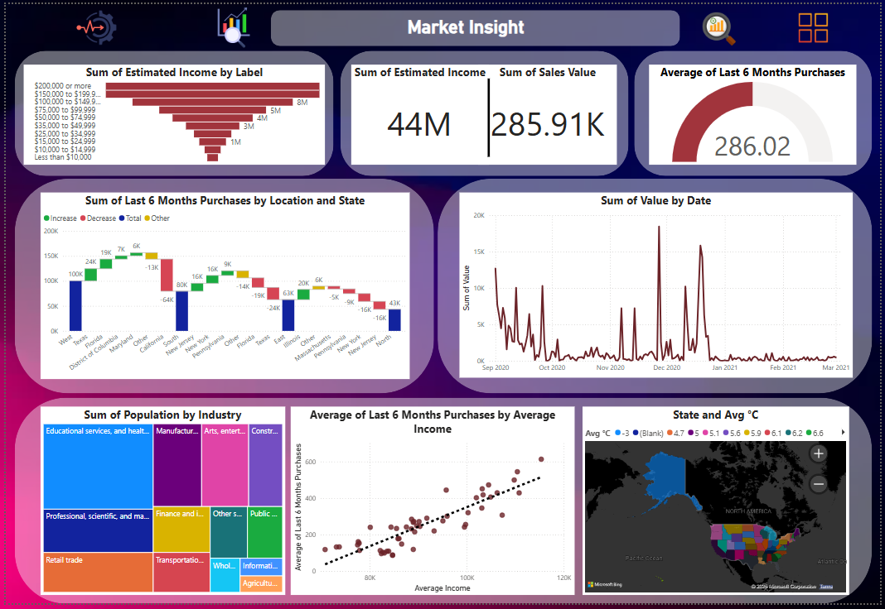
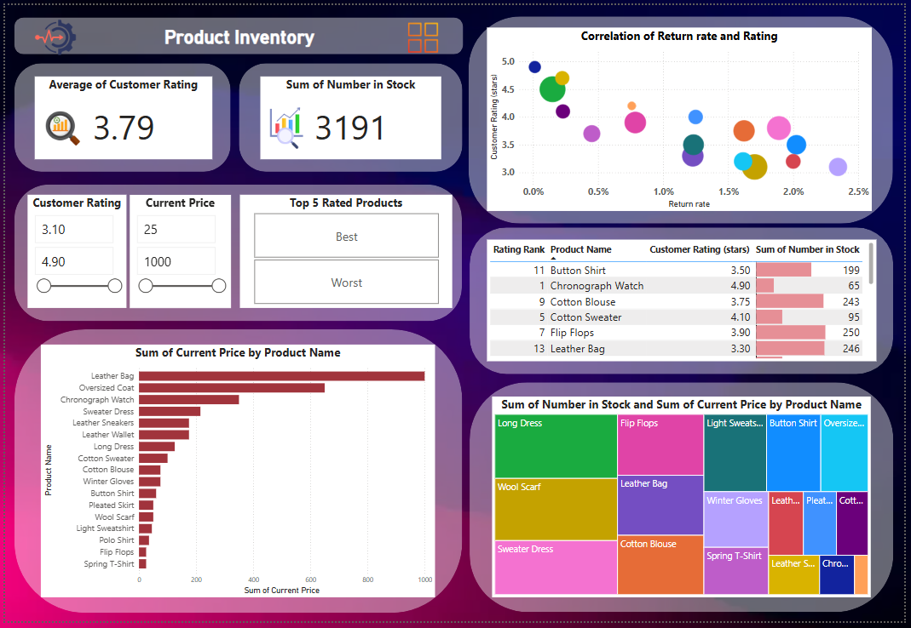
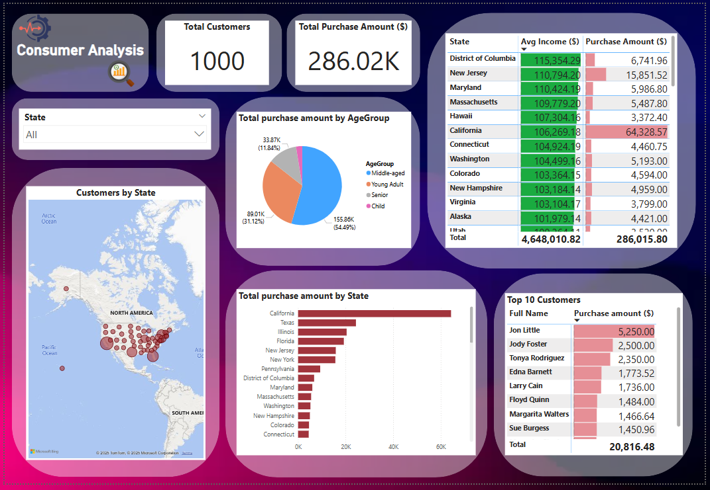

# Nation-Clothing-Chain-Analysis

## Giới thiệu
Đây là đồ án cuối kỳ của học phần Trực quan hóa dữ liệu.

Project phân tích chuỗi cung ứng quần áo trực tuyến quốc gia tại Mỹ. Mục tiêu giúp chuỗi cửa hàng quần áo nghiên cứu và tìm ra chiến lược kinh doanh mới dựa trên dữ liệu thực tế.

---

## Mục tiêu dự án

Các mục tiêu chính:

- Phân tích các yếu tố liên quan đến khu vực địa lý (tiểu bang) và các yếu tố xã hội như dân số, thu nhập, ngành nghề để hiểu rõ tình hình thị trường. Từ đó xây dựng chiến lược tiếp cận khách hàng và tối ưu hóa các hoạt động tiếp thị theo từng khu vực.
- Đánh giá hiệu suất của các sản phẩm tồn kho nhằm xác định các sản phẩm bán chạy, sản phẩm có tỷ lệ trả lại cao hoặc thấp, cũng như các yếu tố khác như giá cả và đánh giá của khách hàng, giúp tối ưu hóa chiến lược quản lý sản phẩm.
- Phân tích nhóm khách hàng dựa trên độ tuổi, thu nhập và vị trí địa lý để tối ưu hóa chiến lược tiếp cận và bán hàng. Qua đó xây dựng các chiến dịch tiếp thị phù hợp với nhu cầu và khả năng chi trả của từng nhóm khách hàng.

---

## Dữ liệu sử dụng

- **census-data.xlsx**: Dữ liệu do US Census Bureau thu thập, bao gồm các thông tin về thu nhập trung bình, vị trí địa lý, dân số và ngành nghề.
- **customer-list.xlsx**: Danh sách khách hàng.
- **purchase-list.xlsx**: Danh sách các sản phẩm đã mua.
- **state-list.xlsx**: Danh sách các bang có chuỗi cửa hàng.
- Ngoài ra, dữ liệu về thời tiết được truy xuất từ Weather US.

---

## Nhiệm vụ nhóm

| Họ và tên          | Phân công công việc                                       |
|--------------------|-----------------------------------------------------------|
| Đào Huy Hoàng      | Làm Dashboard 1, viết báo cáo, thiết kế outline, tổng hợp |
| Nguyễn Vũ Tiến Dũng| Làm Dashboard 3, viết báo cáo                             |
| Lê Hồng Cát        | Viết báo cáo, đóng góp ý kiến, thuyết trình               |
| **Nguyễn Minh Hùng**  | Làm Dashboard 2, viết báo cáo                             |
| Nguyễn Trung Đức   | Làm Dashboard 2, viết báo cáo                             |
| Phạm Ngọc Trai     | Viết báo cáo, đóng góp ý kiến                             |

---

## Dashboard

### Dashboard Market Insights

### Dashboard Product Inventory

### Dashboard Consumer Analysis

---

## Kết quả

Dự án đã thành công trong việc xây dựng ba dashboard, mỗi dashboard tập trung vào một khía cạnh quan trọng của hoạt động kinh doanh:

- Thông tin thị trường (Market Insight)
- Hàng tồn kho (Product Inventory)
- Phân tích khách hàng (Customer Analysis)

Các dashboard cung cấp dữ liệu trực quan và phân tích có giá trị, hỗ trợ hiệu quả quá trình ra quyết định kinh doanh của chuỗi cửa hàng.

---
